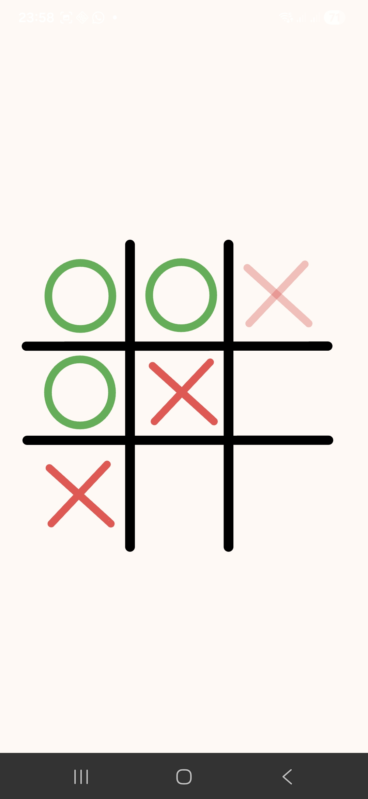

🎮 Tic Tac Toe – Android Game (Java)

A simple but polished 3×3 Tic Tac Toe game built for Android. Designed with a custom UI theme and smooth gameplay experience — not the boring default Material purple buttons you see everywhere.

🧩 Game Features

2-player local gameplay

Win, loss, and draw detection

Restart / New Game button

Clean layout and custom graphics

Works on all screen sizes

Screenshots

📥 Download & Play

👉 Latest Release APK:
(https://github.com/invinciblejaz/TicTacToe/releases/download/v1.0.0/app-release.apk)

(Anyone can download and install the APK from the link above.)

🛠️ Tech Stack
Layer	Tools
Language	Java
UI	XML Layouts, Vector Drawables
IDE	Android Studio
Build System	Gradle
Version Control	Git & GitHub

🚀 About the Development

This project helped solidify:

Implementing game logic without external libraries

Activity lifecycle + event handling

Creating custom UI instead of default Material theme

Git workflow + generating signed release builds (AAB / APK)

Creating GitHub Releases for production apps

🧱 Future Improvements

A few planned upgrades:

Single-player mode with AI

Score counter

Online multiplayer

